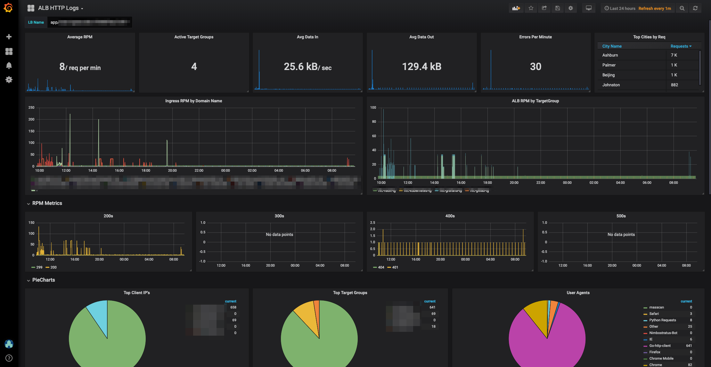

# AWS ALB/ELB Logs for ELK

## Usage 
1. Setup an S3 Bucket for your logs from your AWS LB.  Check this link out for more information on how to do that: [AWS S3 Bucket LB Logs Setup](https://docs.aws.amazon.com/elasticloadbalancing/latest/application/load-balancer-access-logs.html)
2. Configure an S3 input for your logstash instance, you can use the `logstash-input-s3.conf` here as a reference.  Additional reference for the s3 input can be found here:  [Logstash s3 input plugin](https://www.elastic.co/guide/en/logstash/current/plugins-inputs-s3.html)
3. Copy the filter (`logstash-filter-alb-logs.conf`) into your logstash configuration.  This is the "meat and potatoes" that does the parsing of the ALB logs
4. Configure you output to elasticsearch (`logstash-output-elasticsearch.conf` for reference)
5. Load the `grafana-dashboard.json` into your Grafana instance (sorry no Kibana dashboard at this time)
6. ???
7. Profit

## Requirements
* ELK Stack 
* Grafana
  * Grafana plugins
    * [Worldmap](https://grafana.com/plugins/grafana-worldmap-panel)
    * [Piechart](https://grafana.com/plugins/grafana-piechart-panel)

